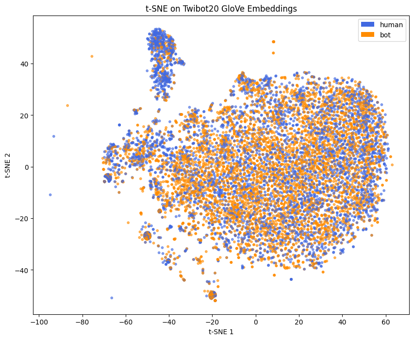
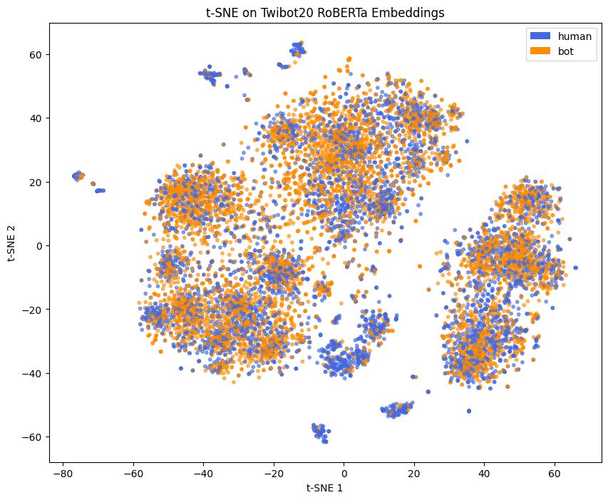
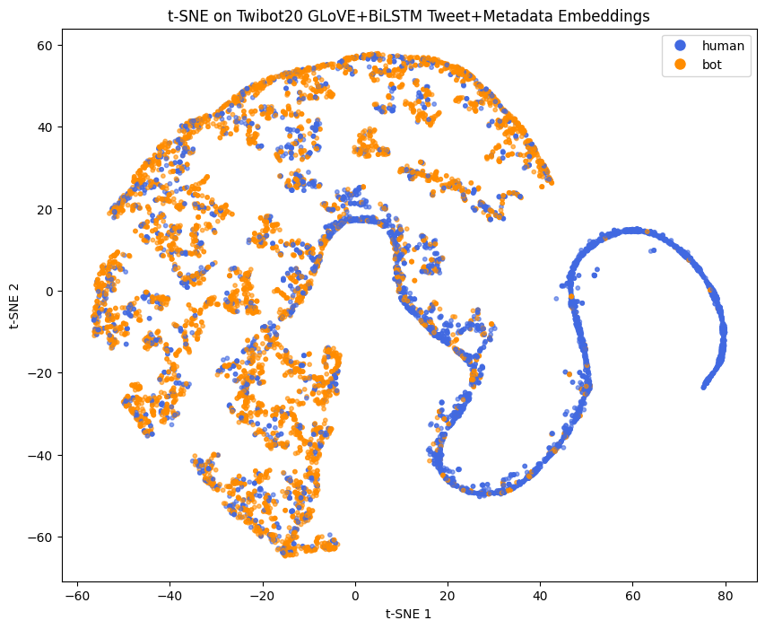

# 2024 US Elections Twitter Data Bot Detector

Detect bots from the 2024 US Elections Twitter data which comprises of tweets and metadata (followers count, friends count, favorites count, listed count, and verified). The data is transformed into embeddings and is fed to our model which classifies whether a tweet, which leverages user metadata, is written by a bot.

## Environment Setup
1. Install anaconda or miniconda.
2. Run `conda env create -f environment.yml`
3. Activate the conda environment:
   - Windows command: `activate bot-detector` 
   - MacOS / Linux command: `conda activate bot-detector`

## Dataset
The Twibot20 dataset was requested from the main author of "TwiBot-20: A Comprehensive Twitter Bot Detection Benchmark". To request the data, his email can be found on https://github.com/BunsenFeng/TwiBot-20.

The US 2024 Elections dataset can be downloaded on https://github.com/sinking8/usc-x-24-us-election.

Make sure to put these datasets in a folder named 'Data' in the main directory.

## Generate Embeddings
Under "Data_Pre_Processing", run all cells in the notebook to generate either Glove or Roberta Embeddings for both tweet data and metadata of Twibot20 or Elections 2024 dataset.

## Baseline Implementation
Based on “Deep Neural Networks for Bot Detection” paper by Kudugunta et al. which uses a Contextual LSTM (200D GloVE) model. Our goal is to match the following performance metric scores reported on “TwiBot-20: A Comprehensive Twitter Bot Detection Benchmark” paper by Feng et al. for this model.

Run all the cells in either notebooks (with or without auxiliary output) under "Baseline_Implementation" to get the performance metrics for the Twibot20 dataset.

## Improved Implementation
Our team ran the following experiments on the Twibot20 dataset to improve the baseline implementation:
1. BiLSTM without Auxiliary Output and 200D Glove Embeddings
2. BiLSTM with Auxiliary Output and 200D Glove Embeddings
3. BiLSTM without Auxiliary Output and 200D Roberta Embeddings
4. DenseNet and using 200D Roberta Embeddings
5. BiLSTM without Auxiliary Output, DenseNet, and 200D Glove Embeddings
6. Transformer, BiLSTM without Auxiliary Output, and 200D Glove Embeddings

To run an implementation above, select the respective notebook under "Improved_Implementation" and run all cells just before grid search. The performance of these implementations are tabulated below:

| Implementation                    | With Auxiliary Output | Embedding        | Accuracy | F1     | MCC    |
|-----------------------------------|-----------------------|------------------|----------|--------|--------|
| LSTM (baseline)                   | Yes                   | Glove (200D)     | 0.8295   | 0.8403 | 0.6598 |
| BiLSTM                            | No                    | Glove (200D)     | 0.8235   | 0.8418 | 0.6548 |
| BiLSTM                            | Yes                   | Glove (200D)     | 0.8180   | 0.8384 | 0.6459 |
| DenseNet                          | No                    | Roberta (200D)   | 0.7650   | 0.7575 | 0.5554 |
| BiLSTM                            | No                    | Roberta (200D)   | 0.8075   | 0.8039 | 0.6306 |
| BiLSTM + DenseNet                 | No                    | Glove (200D)     | 0.8378   | 0.8335 | 0.7034 |
| Encoder-only Transformer + BiLSTM | No                    | Glove (200D)     | 0.8073   | 0.8118 | 0.6145 |

## Embedding Visualization
We used t-SNE to visualize the resulting Embedding when applying either GloVE or RoBERTa, in conjunction with the BiLSTM layer, on the Twibot dataset. The plots are shown below:

From the results above, transforming tweet data to GloVE and RoBERTa embeddings result to different t-SNE outputs. However, when this data is fed to the BiLSTM, then concatenated with the metadata, the resulting t-SNE outputs are similar. This suggests that the metadata is more than likely providing meaningful features compared to tweet data. 

## Bot Detector Using our Best Model on 2024 US Elections Data

 
