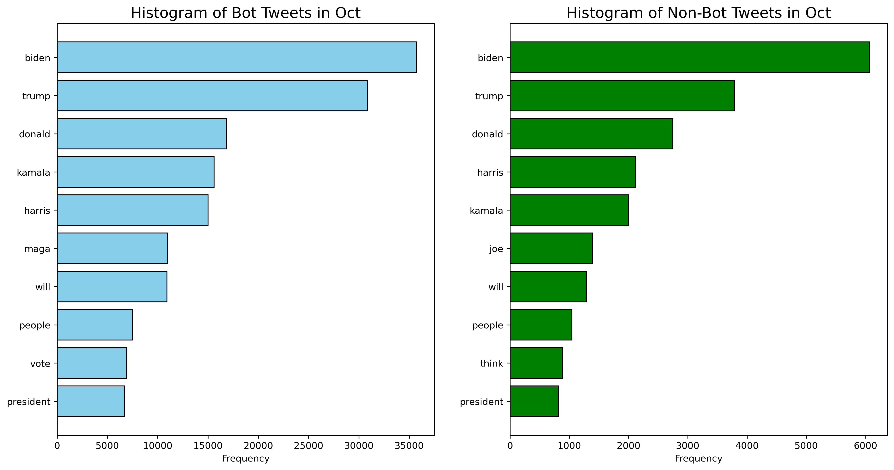
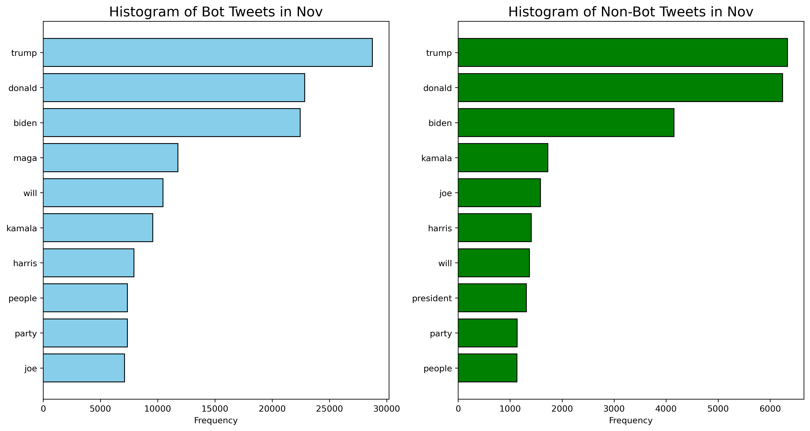

# 2024 US Elections Twitter Data Bot Detector

Detect bots from the 2024 US Elections Twitter data which comprises of tweets and metadata (followers count, friends count, favorites count, listed count, and verification status). The data is transformed into embeddings and is fed to our best-performing model which classifies whether a tweet, which leverages user metadata, is written by a bot.

## Paper
Our project paper can be found on https://drive.google.com/file/d/1rDiU8aDaY4uyTF26wNXlgT7AuzsTER8Y/view?usp=sharing.

## Environment Setup
1. Install anaconda or miniconda.
2. Run `conda env create -f environment.yml`
3. Activate the conda environment:
   - Windows command: `activate bot-detector` 
   - MacOS / Linux command: `conda activate bot-detector`

## Data
The Twibot20 dataset was requested from the main author of "TwiBot-20: A Comprehensive Twitter Bot Detection Benchmark". To request the data, his email can be found on https://github.com/BunsenFeng/TwiBot-20.

The US 2024 Elections dataset can be downloaded on https://github.com/sinking8/usc-x-24-us-election.

In addition, the checkpoints for the best-performing model can be found on https://gtvault-my.sharepoint.com/:f:/g/personal/dsolon3_gatech_edu/ElRC-s0pkeNKpfdEPhiYKJcBUNPU4bUSQ08Q9djCYdDhAQ.

**Make sure to put the datasets in a folder named 'Data' and the model checkpoints in a sub-folder named 'Data/Models' from the base directory.**

## Generate Embeddings
Under "Data_Pre_Processing", run all cells in the notebook to generate either Glove or Roberta Embeddings for both tweet data and metadata of Twibot20 or 2024 US Elections dataset.

## Baseline Implementation
Based on “Deep Neural Networks for Bot Detection” paper by Kudugunta et al. which uses a Contextual LSTM (200D GloVE) model. Our goal is to match the performance metric scores reported on “TwiBot-20: A Comprehensive Twitter Bot Detection Benchmark” paper by Feng et al. for this model. The baseline architecture is shown below.

Run all the cells in either notebooks (with or without auxiliary output) under "Baseline_Implementation" to get the performance metrics for the Twibot20 dataset.

## Improved Implementation
Our team ran experiments to improve the baseline implementation as shown on the table below. To run a specific approach, select the respective notebook under "Improved_Implementation" and run all cells just before grid search.

| Approach                               | Auxiliary Output | Embedding          | ACC    | F1     | MCC    |
|----------------------------------------|------------------|--------------------|--------|--------|--------|
| LSTM (baseline)                        | Yes              | Glove              | 0.8295 | 0.8403 | 0.6598 |
| BiLSTM                                 | No               | Glove              | 0.8235 | 0.8418 | 0.6548 |
| BiLSTM                                 | Yes              | Glove              | 0.8180 | 0.8384 | 0.6459 |
| DenseNet                               | No               | Roberta (768D)     | 0.7650 | 0.7575 | 0.5554 |
| BiLSTM                                 | No               | Roberta (200D)     | 0.8075 | 0.8039 | 0.6306 |
| BiLSTM + DenseNet                      | No               | Glove              | 0.8378 | 0.8335 | 0.7034 |
| BiLSTM + DenseNet (Metadata scaled)    | No               | Glove              | **0.8592** | **0.8571** | **0.7328** |
| BiLSTM + DenseNet                      | No               | RoBERTa (200D)     | 0.8337 | 0.8285 | 0.7007 |
| BiLSTM + Encoder-only Transformer      | No               | Glove              | 0.8073 | 0.8118 | 0.6145 |

## Embedding Visualization
We used t-SNE to visualize the resulting Embedding when applying either GloVE or RoBERTa, in conjunction with the BiLSTM layer and concatenating with the metadata, on the Twibot20 dataset. The plots are shown below:

<table>
  <tr>
    <td></td>
    <td></td>
  </tr>
</table>

<table>
  <tr>
    <td></td>
    <td></td>
  </tr>
</table>

<table>
  <tr>
   <td></td>
    <td></td>
  </tr>
</table>

## Bot Detector Using our Best Model on 2024 US Elections Data
Testing our model on the Elections data, we get the results as follows:

| Month | Predicted Bots | Total Samples | Percentage (%) |
|-------|----------------|---------------|----------------|
| Aug   | 134453        | 150,000       | 89.63%         |
| Sept  | 132878        | 150,000       | 88.58%         |
| Oct   | 133948       | 150,000       | 89.29%         |
| Nov   | 130236        | 150,000       | 86.82%         |

Our model almost always predicts a sample datapoint as a bot which seems obnoxious. Instead, we investigate whether bot activity through the months are reasonable. Below is a plot of normalized predicted bots per month, where the November datapoints are sampled post-election.

The values seem reasonable where there is less bot activity post-election. Now, let's see what our classifier is learning content-wise by comparing the most frequent words from tweets in both classes for the months of October (pre-election) and November (post-election).

The similarity in word frequency between the two classes indicates that tweet content alone is insufficient for reliably distinguishing between bots and humans; metadata plays a critical role in enhancing classification performance.
